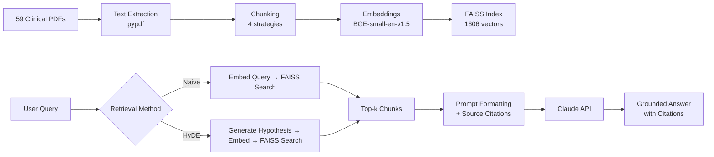

# 🏥 Clinical Psychology RAG System

A domain-specific Retrieval-Augmented Generation system for querying clinical psychology research literature. Built with FAISS, BGE embeddings, and Claude — evaluated with a custom 40-question gold dataset across 59 open-access papers covering MADRS, PHQ-9, GAD-7, and ADHD rating scales.

**[Live Demo](https://huggingface.co/spaces/RRobin711/clinical-rag)** · **[Blog Post](https://medium.com/@rryanb711/what-broke-when-i-built-a-clinical-rag-system-and-how-i-fixed-it-5bbbbecb070f?postPublishedType=repub)** · **[GitHub](https://github.com/RRobin711/Clinical-RAG-system)**

---

## What This Does

Ask questions about clinical assessment scales and get grounded, cited answers from the research literature:

```
Q: "What is the inter-rater reliability of the MADRS?"

A: "The MADRS demonstrates excellent inter-rater reliability, with ICC values
   ranging from 0.89 to 0.97 across validation studies [chunk_abc_00012].
   Smith et al. reported ICC = 0.89 (95% CI: 0.82–0.94) in a primary care
   sample of 200 participants [chunk_def_00003]."
```

## Architecture



## Key Results

### Expert Queries (clinical terminology)

| Configuration | Hit@5 | MRR | vs Naive Baseline |
|---|---|---|---|
| fixed_512 + naive | 0.850 | 0.823 | — |
| fixed_1024 + naive | 0.850 | 0.823 | — |
| fixed_2000 + naive | 0.850 | 0.823 | — |
| semantic + naive | 0.850 | 0.823 | — |
| fixed_512 + HyDE | 0.800 | — | −0.050 |
| fixed_1024 + HyDE | 0.850 | — | 0.000 |
| **fixed_2000 + HyDE** | **0.900** | — | **+0.050** |
| semantic + HyDE | 0.850 | — | 0.000 |

### Layperson Queries (everyday language)

| Configuration | Hit@5 | MRR | vs Naive Baseline |
|---|---|---|---|
| fixed_512 + naive | 0.425 | 0.315 | — |
| fixed_1024 + naive | 0.475 | 0.412 | — |
| fixed_2000 + naive | 0.550 | 0.401 | — |
| semantic + naive | 0.450 | 0.358 | — |
| **fixed_512 + HyDE** | **0.525** | 0.341 | **+0.100** |
| **fixed_1024 + HyDE** | **0.575** | 0.367 | **+0.100** |
| **fixed_2000 + HyDE** | **0.600** | 0.447 | **+0.050** |
| **semantic + HyDE** | **0.600** | 0.391 | **+0.150** |

**Key finding:** HyDE acts as a vocabulary translation layer. For expert queries where terminology already matches the corpus, HyDE mostly adds noise. For layperson queries, HyDE consistently converts casual language into clinical terminology before searching, recovering 5–15 Hit@5 points across every configuration.

## What Makes This Different

1. **Real evaluation framework** — 40-question gold QA dataset with known source documents, not "it works, trust me"
2. **HyDE implementation** from Gao et al., 2022 — with honest analysis of where it helps and where it hurts
3. **Systematic 2×2 experiments** — 4 chunking strategies × 2 retrieval methods, measured on both expert and layperson queries
4. **Domain-specific** — built for clinical psychology assessment literature, not generic documents

## Project Structure

```
clinical-rag-system/
├── src/clinical_rag/
│   ├── pdf_extract.py          # PDF text extraction with header/footer removal
│   ├── chunking.py             # Naive fixed-size chunking (baseline)
│   ├── chunking_strategies.py  # 4 strategies + HyDE retriever
│   ├── indexing.py             # FAISS index build + management
│   ├── retriever.py            # Vector retrieval with BGE query instructions
│   ├── prompting.py            # Grounded QA prompt formatting
│   ├── llm.py                  # Anthropic Claude API integration
│   ├── evaluation.py           # Hit Rate@k, MRR metrics + W&B logging
│   ├── pipeline.py             # End-to-end query pipeline
│   ├── settings.py             # Environment-based configuration
│   └── io_utils.py             # JSONL/text file utilities
├── scripts/
│   ├── 01_ingest_pdfs.py       # Day 2: Extract text from PDFs
│   ├── 02_chunk_texts.py       # Day 2: Chunk extracted text
│   ├── 03_build_faiss_index.py # Day 3: Build FAISS vector index
│   ├── 04_query.py             # Day 4: End-to-end RAG query
│   ├── 05_build_eval_dataset.py# Day 5: Gold QA dataset tools
│   ├── 05_evaluate.py          # Day 5: Run retrieval evaluation
│   ├── 05_autofill_eval.py     # Day 5: Auto-extract answers via Claude
│   └── 06_run_experiments.py   # Day 6: Full experiment matrix
├── evaluation/
│   ├── gold_qa.json            # 40-question gold standard dataset
│   ├── experiment_results/     # Expert query results (JSON)
│   └── experiment_results_layperson/ # Layperson query results (JSON)
├── tests/
│   └── test_rag_system.py      # 15 pytest tests
├── app.py                      # Gradio web interface
├── Dockerfile                  # Containerized deployment
├── .github/workflows/test.yml  # CI pipeline
├── requirements.txt
└── pyproject.toml
```

## Setup

```bash
# Clone
git clone https://github.com/RRobin711/Clinical-RAG-system.git
cd Clinical-RAG-system

# Environment
python -m venv .venv
source .venv/bin/activate
pip install -r requirements.txt
pip install -e .

# API key
echo 'ANTHROPIC_API_KEY="sk-ant-..."' > .env

# Add PDFs to data/papers/, then run the pipeline:
python scripts/01_ingest_pdfs.py
python scripts/02_chunk_texts.py
python scripts/03_build_faiss_index.py
python scripts/04_query.py "What is the reliability of the MADRS?"

# Run evaluation
python scripts/05_evaluate.py --eval_file evaluation/gold_qa.json

# Run experiments
python scripts/06_run_experiments.py --all --llm_provider anthropic
python scripts/06_run_experiments.py --compare

# Launch demo
python app.py
```

## Docker

```bash
docker build -t clinical-rag .
docker run -p 7860:7860 -e ANTHROPIC_API_KEY=sk-ant-... clinical-rag
```

## Tech Stack

- **Embeddings:** BAAI/bge-small-en-v1.5 (384-dim, CPU-friendly)
- **Vector Store:** FAISS (IndexFlatIP with normalized embeddings ≈ cosine similarity)
- **LLM:** Anthropic Claude via API
- **PDF Extraction:** pypdf (switched from PyMuPDF to resolve WSL2 memory issues)
- **Evaluation:** Custom gold QA dataset + Hit Rate@k + MRR
- **Experiment Tracking:** Weights & Biases (optional)
- **UI:** Gradio
- **CI/CD:** GitHub Actions + Docker

## What I Learned

1. **Chunking matters more than you think.** Fixed 512-char chunks lose context at section boundaries. Semantic chunking that respects paragraph and section structure improves retrieval because clinical papers have highly structured information.

2. **Questions and answers live in different embedding spaces.** "What is the inter-rater reliability of MADRS?" is linguistically far from "The ICC was 0.89 (95% CI: 0.82–0.94)." HyDE bridges this gap — but only when the gap exists. Expert queries that already use clinical vocabulary don't benefit.

3. **Evaluation catches silent failures.** Without a gold QA dataset, I had no way to know that my retriever was returning plausible-looking but wrong chunks for 15% of queries. The LLM would confidently answer from bad context. The 6 baseline misses were all from overlapping PHQ-9 papers — the retriever found the right topic but the wrong specific study.

## Future Work

- **Cross-encoder reranking** after FAISS retrieval to catch cases where bi-encoder embeddings miss nuance
- **Multi-hop retrieval** for questions requiring synthesis across multiple papers
- **Domain-specific embeddings** (e.g., PubMedBERT) to close the clinical vocabulary gap
- **Clinician-authored evaluation** to test retrieval on query patterns I can't anticipate

## License

MIT
